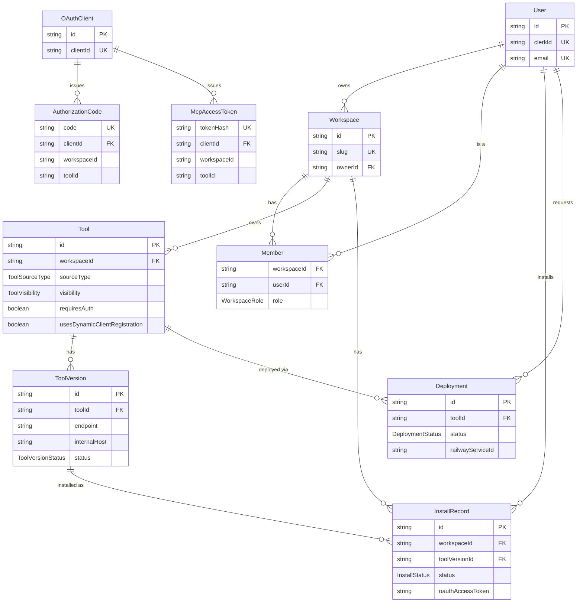
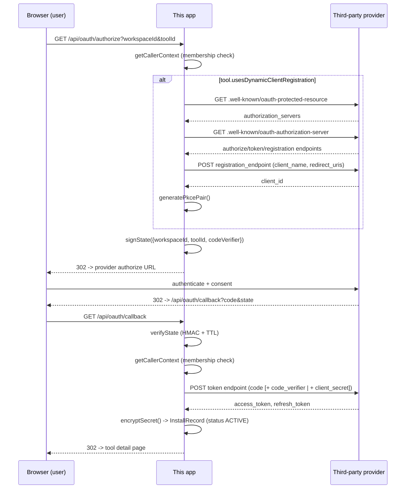
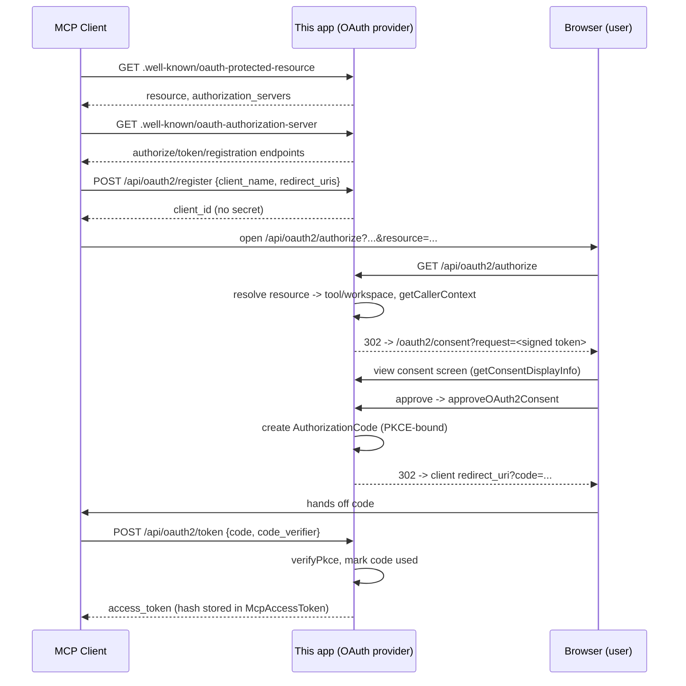

# MCP Marketplace — Project Overview

*Generated from a direct reading of the codebase on 2026-08-01. Where something looked unfinished or ambiguous, that's called out explicitly rather than assumed.*

---

## 1. What this project is

MCP Marketplace is a multi-tenant platform for discovering, installing, and running [Model Context Protocol](https://modelcontextprotocol.io) servers ("tools") inside team **workspaces**. A workspace can install pre-built, published tools from a shared marketplace; deploy its own custom MCP server straight from a GitHub repo, an npm/PyPI package, or a Docker image (built and hosted on Railway); or connect a tool that itself requires OAuth against a third party (Linear, Notion, etc.). Every tool — marketplace or custom — is reachable through a single gateway URL (`/{workspaceSlug}/{toolSlug}/mcp`) that any MCP client can talk to, and the platform itself doubles as an OAuth 2.0 authorization server so third-party MCP clients (Claude, other agents) can log a user into a specific workspace's tool without ever seeing that workspace's real credentials. It's aimed at teams who want to run and share MCP tooling without every member hand-rolling their own server deployment or OAuth plumbing.

---

## 2. Tech stack

Real dependencies from `package.json`, with what each one is actually doing in this codebase (not a generic blurb):

- **Next.js 16.2.10** — App Router backbone; also the source of a `proxy.ts` convention (replacing the deprecated `middleware.ts`) used here purely to gate Clerk auth on two routes.
- **React 19.2.4 / react-dom 19.2.4** — required peer for Next 16.
- **@clerk/nextjs / @clerk/types** — the entire user identity layer; `currentUser()` is the only source of "who is logged in" everywhere in `src/actions` and `src/hooks/useCallerContext.ts`.
- **@prisma/client / prisma** — ORM against Postgres; `src/lib/prisma.ts` exports the singleton `client` imported by every server action and route handler.
- **@tanstack/react-query** — not just data fetching: it's the polling engine for both live deploy progress (`deploy-panel.tsx` polls `pollDeploymentStatus` every 3s) and tool-detail install status (`tool-detail-content.tsx` polls `getToolDetail` every 3s while status is in-flight).
- **zustand** — a single small global store (`useMcpStore`) that only tracks sign-in/sign-up modal open state, nothing domain-related.
- **ajv** — JSON Schema validation; present as a dependency for validating `ToolCapability.inputSchema`/`outputSchema`, though no direct usage was found wired into an action yet (see §7).
- **e2b** — sandboxed code execution SDK; the `SandboxSession`/`SandboxProvider` (E2B/MODAL) Prisma models exist for it, but nothing in `src/` currently calls the `e2b` package — it's schema-ready, not code-ready (see §7).
- **resend** — transactional email; `src/lib/resend-client.ts` wraps it, used by `sendInvite` in `src/actions/invite.tsx` to actually deliver workspace invite emails.
- **class-variance-authority, clsx, tailwind-merge, tailwindcss-animate, tw-animate-css** — the shadcn/ui component styling toolchain used throughout `src/components/ui`.
- **@shadcn/react, shadcn** — the generated UI primitive library (accordion, dialog, sheet, etc.) that makes up nearly all of `src/components/ui`.
- **cmdk** — powers `SearchModal.tsx` (workspace/command search in the sidebar).
- **embla-carousel-react** — backs `components/ui/carousel.tsx`.
- **react-resizable-panels** — backs `components/ui/resizable.tsx`.
- **recharts** — backs `components/ui/chart.tsx`; no dashboard currently renders a chart with real data, so this is UI-kit scaffolding, not yet wired to `ToolAnalytics`/`ToolExecution` data.
- **date-fns** — date formatting utility available to any component that needs it.
- **react-day-picker** — backs the `calendar.tsx` UI primitive.
- **input-otp** — backs `input-otp.tsx`, available for OTP-style flows (not currently used in the Clerk sign-in/up forms, which use Clerk's own verification-code UI).
- **lucide-react** — icon set used everywhere.
- **next-themes** — light/dark theme provider (`providers/theme-provider.tsx`).
- **sonner** — toast notifications (`components/ui/sonner.tsx`).
- **tailwindcss / @tailwindcss/postcss** — styling engine.

**Deployment integration is via direct GraphQL, not an SDK**: `src/lib/railway-client.ts` hand-rolls calls to `https://backboard.railway.com/graphql/v2` — there's no Railway npm client in `package.json`; every mutation/query used (`projectCreate`, `serviceCreate`, `serviceInstanceLimitsUpdate`, etc.) is a literal GraphQL string.

---

## 3. Data model

Walked from `prisma/schema.prisma`. Supporting models **Category**, **Tag**, **ToolCategory**, **ToolTag**, **Review**, **ToolAnalytics**, **ToolExecution**, **ExecutionQuota**, **SandboxSession**, **ToolNetworkPermission**, **ToolCapability**, **ToolVariable**, **ToolVariableValue** are described below but omitted from the ER diagram to keep it readable — they're real, schema-complete models, but peripheral to the core install/deploy/connect story.

### Core models

- **User** — mirrors a Clerk identity (`clerkId` unique). Created lazily by `onAuthenticateUser()` (`src/actions/user.ts`) the first time someone completes Clerk sign-in and hits `/callback`; that same call also creates the user's first personal `Workspace` in a transaction.
- **Workspace** — the tenancy boundary. Has exactly one `ownerId` (a `User`), plus any number of `Member` rows. Created either by `onAuthenticateUser` (auto, on first login) or `createWorkspace` (`src/actions/workspace.ts`, user-triggered "New workspace").
- **Member** — join table for `Workspace` ↔ `User` with a `WorkspaceRole` (`OWNER | ADMIN | MEMBER`). The workspace *owner* is never actually given a `Member` row with role `OWNER` by default in the code paths read — `getCallerContext`/`verifyAccessToWorkspace` instead treat `workspace.ownerId === user.id` as an implicit `OWNER`, falling back to the `Member.role` only for non-owners. (Exception: `createWorkspace` *does* also insert a `Member` row with `role: "OWNER"` for the creator, so for workspaces created via that path both mechanisms agree.)
- **GithubConnection** — modeled (one per workspace, stores a GitHub App `installationId`) but **not referenced anywhere in `src/`** outside generated Prisma boilerplate. This is the schema half of a GitHub-App-based private-repo deploy flow that was never built (see §7).
- **Tool** — a marketplace listing or a custom deploy target. Distinguishing fields:
  - `visibility` (`PUBLIC | PRIVATE`) — marketplace tools created via `deployCustomTool` are always created `PRIVATE` (workspace-scoped, not publicly listed); only tools explicitly published to the marketplace are `PUBLIC`.
  - `sourceType` (`GITHUB | NPM | PYPI | DOCKER`) — set from the deploy form's `source` selection via an explicit `SOURCE_TYPE_MAP` in `deploy.ts`.
  - `requiresAuth` + the `oauth*` fields — set for tools that need a third-party OAuth connection (classic pre-registered app, or DCR). `usesDynamicClientRegistration` selects which of the two authorize/callback code paths runs.
- **ToolVersion** — one publishable version of a `Tool`, with an `endpoint` (the gateway-facing URL) and `internalHost` (the real Railway domain, used server-side only by the gateway). `status` (`DRAFT | TESTING | PUBLISHED | FAILED | ARCHIVED`) gates marketplace visibility (`searchMarketplaceTools` only returns tools with a `PUBLISHED` version) and installability (`installTool` rejects non-`PUBLISHED` versions). For a custom Railway deploy, the *first* `ToolVersion` (`1.0.0`) is created automatically — not by the user — inside `pollDeploymentStatus` the moment it observes the underlying `Deployment` reach `RUNNING` (see §4b); it's set `PUBLISHED` immediately with one placeholder `ToolCapability` named `"default"`.
- **ToolCapability** — one callable capability (tool call) on a version, with input/output JSON Schemas and example payloads. Auto-stubbed (`name: "default"`) on custom deploys; presumably hand-authored for real marketplace listings, though no admin UI for authoring these was found in `src/app`.
- **ToolVariable / ToolVariableValue** — declared env-var requirements on a version, and a workspace's actual values for them. `deploy.ts`'s `detectToolVariables` scans `.env.example`/`.env.sample`/`Dockerfile ENV` in the source repo to *suggest* these at deploy time, but the deploy flow writes detected variables straight to Railway as service variables (`RAILWAY_VARIABLE_UPSERT`) — no code path was found that also persists them into `ToolVariable`/`ToolVariableValue` rows, so those two tables currently look unpopulated by the working deploy flow (schema-ready, not wired).
- **InstallRecord** — the single row that represents "this workspace has this tool version." One per `(workspaceId, toolVersionId)`. `status` (`InstallStatus`: `NOT_CONNECTED | PENDING | ACTIVE | FAILED`) is the crux of flow (a)/(c):
  - `NOT_CONNECTED` — set at creation (`installTool`) when `tool.requiresAuth` is true; the user has added the tool but never started the OAuth handshake.
  - `PENDING` — set by `installTool` for a `GITHUB`-method non-auth install (rare path), and re-set by the OAuth callback (`markPending`) whenever the flow fails in a retryable way (user cancelled, or a transient token-exchange error).
  - `ACTIVE` — set immediately for a `MANUAL`, non-auth-required install; or set by the OAuth callback on a genuinely successful token exchange.
  - `FAILED` — set by the OAuth callback (`markFailed`) only for non-retryable failures: no client secret configured, or a provider error code in `CONFIG_ERROR_CODES` (`invalid_client`, `unauthorized_client`).
  - Also carries the encrypted third-party `oauthAccessToken`/`oauthRefreshToken`/`oauthExpiresAt` for tools installed via classic/DCR OAuth (flow c) — this is distinct from the platform's own OAuth2-provider tokens in `McpAccessToken`.
- **Deployment** — one Railway deploy attempt for a custom `Tool`. `status` (`DeploymentStatus`: `PENDING | BUILDING | DEPLOYING | RUNNING | ERROR`) is driven entirely by polling Railway's own deployment status (`pollDeploymentStatus`, mapped from Railway's real GraphQL enum — verified against introspection, not docs). Stores the live `railwayProjectId/EnvironmentId/ServiceId/Domain` needed both to poll and to clean up (delete the Railway project) on failure.
- **OAuthClient / AuthorizationCode / McpAccessToken** — the platform's own OAuth2-provider surface (flow d). `OAuthClient` rows are created by `/api/oauth2/register` (DCR for MCP clients, no secret). `AuthorizationCode` is single-use, PKCE-bound, 60-second TTL. `McpAccessToken` stores only a SHA-256 hash of the real bearer token (`tokenHash`), never the token itself — the gateway route re-hashes an incoming `Authorization: Bearer` header and looks it up by hash.

### ER diagram



---

## 4. Core flows

### a. Installing a marketplace tool

1. `src/app/dashboard/[workspaceId]/browse/page.tsx` server-renders by calling **`searchMarketplaceTools`** (`src/actions/install.ts`), which queries `Tool` where `visibility: "PUBLIC"` and has at least one `PUBLISHED` version, joined to this workspace's own `InstallRecord` for each tool.
2. `BrowseContent` (`_components/browse-content.tsx`) re-fetches the same query client-side via React Query for live search, and renders an "Add" button per tool driven by `renderAddButton`, which switches on `install.status` (`NOT_CONNECTED → "Connect"`, `PENDING → "Pending"`, `FAILED → "Retry"`, `ACTIVE → "✓ Added"`).
3. Clicking **Add** calls `handleInstall` → **`installTool`** (`src/actions/install.ts`): re-validates caller membership via `getCallerContext`, checks the version is `PUBLISHED` and the tool `PUBLIC`, rejects a duplicate `(workspaceId, toolVersionId)` install, then creates the `InstallRecord` with `initialStatus` computed from `tool.requiresAuth`/`method` (see §3), and increments `ToolAnalytics.totalInstalls`.
4. On success the UI invalidates the `marketplace-tools`/`workspace-installs` query caches and routes to `/dashboard/{workspaceId}/mcp/{toolId}`, landing on **`ToolDetailContent`** (`src/app/dashboard/[workspaceId]/mcp/[toolId]/_components/tool-detail-content.tsx`), fed by **`getToolDetail`** (`src/actions/toll-actions.tsx`). That page is where a tool requiring auth shows its **Authorize** button, kicking into flow (c).

### b. Deploying a custom tool (GitHub/npm/PyPI/Docker) via Railway

1. `DeployPanel` (`src/app/dashboard/[workspaceId]/browse/_components/deploy-panel.tsx`) is a slide-over with three steps: `form → configure → progress`.
2. On the form step, for GitHub it calls **`detectDefaultBranch`**, then in parallel **`detectToolVariables`**, **`detectStartCommand`**, **`checkDeployability`** (all in `src/actions/deploy.ts`) — each does raw `raw.githubusercontent.com` fetches for known marker files (`Dockerfile`, `Procfile`, `railway.json`, `package.json`, `.env.example`) to pre-fill the configure step. For npm/pypi it first calls **`resolvePackageRepo`**, which hits the npm registry or PyPI JSON API to resolve a package name to a GitHub repo URL, then runs the same detection.
3. Submitting on the configure step calls **`deployCustomTool`**: after `getCallerContext` + an `OWNER`/`ADMIN` role check and a per-workspace cooldown check (`DEPLOY_COOLDOWN_SECONDS`, default 15s, guards against rapid-fire Railway project creation), it creates a `Tool` (always `visibility: "PRIVATE"`) with a nested `Deployment` row (`status: "PENDING"`), then drives Railway step by step via `railwayRequest` (`src/lib/railway-client.ts`): `RAILWAY_PROJECT_CREATE` → `RAILWAY_SERVICE_CREATE` → `RAILWAY_SERVICE_INSTANCE_LIMITS_UPDATE` (unconditional CPU/memory cap, so one tool can't starve the account) → optional `RAILWAY_SERVICE_INSTANCE_UPDATE`/`RAILWAY_VARIABLE_UPSERT`/`RAILWAY_SERVICE_DEPLOY` → `RAILWAY_SERVICE_DOMAIN_CREATE`, updating `Deployment.status` to `BUILDING` then `DEPLOYING` along the way. Any Railway call failing triggers `RAILWAY_PROJECT_DELETE` cleanup and marks `Deployment.status: "ERROR"` — but still returns HTTP-level success (`201`) since a real `Deployment` row (in the `ERROR` state) is what the panel needs to move to the progress screen.
4. The progress step polls **`pollDeploymentStatus`** every 3s via React Query, which (after its own `getCallerContext` check) queries Railway's real deployment status and maps Railway's 13-value enum onto the app's 5-value `DeploymentStatus`. The moment it observes `RUNNING` **for the first time** (`!existingVersion` check), it auto-creates the tool's first `ToolVersion` (endpoint built from `NEXT_PUBLIC_GATEWAY_BASE_URL`/workspace-slug/tool-slug) and a matching `ACTIVE` `InstallRecord` for the requesting workspace — this is the only place a custom deploy becomes an installed, usable tool.

### c. Connecting a tool via OAuth (classic and DCR)

Both paths share `GET /api/oauth/authorize` and `GET /api/oauth/callback` (`src/app/api/oauth/{authorize,callback}/route.ts`); which branch runs is decided by `Tool.usesDynamicClientRegistration`.

- **Authorize** (`authorize/route.ts`): validates the caller is a member of `workspaceId` (`getCallerContext`) and that the tool belongs to that workspace and `requiresAuth`. For DCR tools it calls **`ensureDynamicClientRegistered`** (`src/lib/dynamic-clinet-registration.ts`) — a one-time (cached on the `Tool` row) discovery handshake: fetch `{endpoint}/.well-known/oauth-protected-resource` → fetch that server's `/.well-known/oauth-authorization-server` → `POST` to its `registration_endpoint` with `{client_name, redirect_uris: [callbackUrl]}` (RFC 7591), then a `generatePkcePair()` (`src/lib/pkce.ts`) since DCR clients have no secret. For classic tools it just uses the pre-stored `oauthAuthorizeUrl`/`oauthClientId`. Either way it builds a signed, tamper-proof `state` (**`signState`**, `src/lib/oauth-state.ts` — HMAC-SHA256, 10-minute TTL, carries `workspaceId`/`toolId`/optional `codeVerifier`) and redirects to the provider's real authorize URL.
- **Provider round-trip**: user authenticates/consents on the third party's own site.
- **Callback** (`callback/route.ts`): **`verifyState`** decodes and HMAC-validates `state` (constant-time via `safeEqual`, `src/lib/safe-equal.ts`), re-checks caller membership. On a provider-side denial/cancel it marks the install `PENDING` (retryable). On success it exchanges the code for tokens — DCR tools use the carried `code_verifier` (no secret); classic tools use a real client secret pulled either from `process.env[oauthClientSecretEnvKey]` or `decryptSecret(oauthClientSecretEncrypted)` (`src/lib/tool-crypto.ts`, AES-256-GCM). Token-endpoint failures are split into retryable (→ `PENDING`) vs. config-broken (→ `FAILED`, based on `CONFIG_ERROR_CODES`). On real success, both tokens are **encrypted before storage** (`encryptSecret`) into `InstallRecord`, status → `ACTIVE`, and the user is redirected to the tool's detail page.



### d. This app as an OAuth provider for third-party MCP clients (`/api/oauth2/*`)

Flow (c) is *this app acting as an OAuth client* against someone else's provider, to let a workspace call a third-party API. Flow (d) is the mirror image: *this app acting as the OAuth provider* so an external MCP client (Claude, another agent) can obtain a scoped bearer token for one specific workspace+tool, without that client ever touching the third-party credentials from (c) or a user's Clerk session directly. Both exist because they solve different trust boundaries — (c) is "this workspace trusts a third-party API," (d) is "an external MCP client is trusted to reach this one tool, as this logged-in user, in this one workspace."

1. **Discovery**: an MCP client first hits the deployed tool's gateway (flow e) unauthenticated, gets a `401` pointing at `/{workspaceSlug}/{toolSlug}/.well-known/oauth-protected-resource` (`src/app/[workspaceSlug]/[toolSlug]/.well-known/oauth-protected-resource/route.ts`), which returns `{resource, authorization_servers: [gatewayBase]}`. It then fetches the global `/.well-known/oauth-authorization-server` (`src/app/.well-known/oauth-authorization-server/route.ts`) for the real `authorization_endpoint`/`token_endpoint`/`registration_endpoint`.
2. **Register** (`POST /api/oauth2/register`, `src/app/api/oauth2/register/route.ts`): simplified RFC 7591 — client posts `{client_name, redirect_uris}`, gets back a `client_id` with `token_endpoint_auth_method: "none"` (public client, no secret — PKCE only). Persisted as an `OAuthClient` row.
3. **Authorize** (`GET /api/oauth2/authorize`, `src/app/api/oauth2/authorize/route.ts`): validates the request (`response_type=code`, registered `redirect_uri`, `code_challenge`/`S256` only), parses the `resource` param back into a `{workspaceSlug, toolSlug}` and resolves the real `Tool`, then requires the browser to actually be logged into *this platform* (`getCallerContext`) — redirecting to `/login` if not. It then signs a short-lived **auth-request token** (**`signAuthRequest`**, `src/lib/oauth2-request-lib.ts` — same HMAC/TTL pattern as `oauth-state.ts`, distinct secret usage but same `OAUTH_STATE_SECRET`) and redirects to `/oauth2/consent?request=...`.
4. **Consent** (`src/app/oauth2/consent/page.tsx` + `ConsentActions.tsx`): renders "`{clientName}` is requesting access to `{toolName}` in `{workspaceName}`" via **`getConsentDisplayInfo`** (`src/actions/oauth2-consent-actions.ts`). Approve calls **`approveOAuth2Consent`**: re-verifies the request token, creates a single-use `AuthorizationCode` (60s TTL, bound to the original `code_challenge`), redirects to the client's `redirect_uri` with `?code=...`. Deny calls **`denyOAuth2Consent`**, redirecting with `?error=access_denied`.
5. **Token exchange** (`POST /api/oauth2/token`, `src/app/api/oauth2/token/route.ts`): validates grant type, looks up the `AuthorizationCode`, and rejects (uniformly, as `invalid_grant`, to avoid leaking which check failed) if it's missing/used/expired/mismatched-client/mismatched-redirect, or if **`verifyPkce`** fails against the stored `code_challenge`. On success it marks the code `used`, mints a random 32-byte access token, stores only its SHA-256 hash in `McpAccessToken` (1-hour TTL, no refresh token — the client just re-runs the flow), and returns the raw token once.



### e. The gateway/proxy route forwarding a live request

`src/app/[workspaceSlug]/[toolSlug]/mcp/route.ts` (all methods → one `proxy` function) is the single entry point an MCP client actually talks to at runtime:

1. Resolves the `Tool` by `(workspaceSlug, toolSlug)` and its latest `PUBLISHED` `ToolVersion.internalHost` (the real Railway domain). No tool/no host → `404`.
2. Requires `Authorization: Bearer <token>`; if missing, `401` with a `WWW-Authenticate` header pointing at the workspace/tool's own `.well-known/oauth-protected-resource` (flow d, step 1). If present, hashes it and looks up a live, non-revoked `McpAccessToken` scoped to this exact `toolId`.
3. **Outbound auth** (situation A): if `tool.requiresAuth` (this deployed server itself needs to call a third-party API on the caller's behalf), it looks up this workspace's `InstallRecord` for the tool and calls **`getFreshOutboundToken`** (`src/lib/tool-crypto.ts`) — decrypts the stored access token, transparently refreshes it via the tool's `oauthTokenUrl` if expired (using the same client-secret resolution as flow c), and re-encrypts+persists the refreshed pair. The fresh token is forwarded to the upstream server as a custom `X-Upstream-Token` header (not as `Authorization`, since that header is stripped and reserved for gateway-level auth).
4. Strips hop-by-hop headers (`stripHopByHopHeaders`) and proxies the request verbatim to `https://{internalHost}{rest-of-path}` with `redirect: "manual"`.
5. **Situation B**: if the *deployed server itself* also enforces its own MCP-level OAuth (independent of this gateway's own token check) and responds `401` with a `WWW-Authenticate` naming its internal host, the gateway rewrites that header to point back through the public gateway path instead of leaking the internal Railway domain — the companion route `.well-known/[...path]/route.ts` does the same rewrite for any `.well-known` discovery document such a server exposes.

---

## 5. Auth & permissions model

- **Clerk → internal User**: Clerk owns the actual login/session (`clerkMiddleware` in `src/proxy.ts` wraps every non-static request). The bridge to this app's own `User` table is **`onAuthenticateUser`** (`src/actions/user.ts`), called from `/callback` (`src/app/(auth)/callback/page.tsx`) and from the dashboard layout. It's idempotent: if a `User` with this `clerkId` already exists it's returned as-is (with `ownedWorkspaces`/`memberships` eager-loaded); otherwise a `User` **and** their first personal `Workspace` (with a `Member` row, `role: "OWNER"`) are created together in one `$transaction`.
- **`getCallerContext(workspaceId)`** (`src/hooks/useCallerContext.ts`) is the workhorse authorization check, used by nearly every server action and OAuth route that touches a specific workspace (`installTool`, `deployCustomTool`, `pollDeploymentStatus`, `sendInvite`, both `/api/oauth/*` routes, `/api/oauth2/authorize`, `getToolDetail`, etc.). It: resolves the internal `User` from the Clerk session, loads the `Workspace` with just this user's `Member` row, and treats `workspace.ownerId === user.id` as an implicit `OWNER` even without a `Member` row — returning `{userId, callerRole}` or a typed `{error: {status, message}}`. A near-duplicate, **`verifyAccessToWorkspace`** (`src/actions/workspace.ts`), does the same check but returns the full workspace object too — used by the dashboard layout to gate page access, not by the fine-grained actions.
- **`WorkspaceRole` tiers**, traced from real checks (not assumed from the enum names):
  - **OWNER** — implicit via `workspace.ownerId`, never demotable through any code path found. Can do everything ADMIN can, plus (implicitly, since nothing currently restricts owner-only actions beyond the OWNER/ADMIN checks below) everything else.
  - **ADMIN** — `ctx.callerRole !== "OWNER" && ctx.callerRole !== "ADMIN"` gates: `deployCustomTool` (deploy a custom tool), `sendInvite`/`getWorkspaceInvites`/`revokeInvite` (invite management), and (per `members/page.tsx`'s `canInvite`/`MembersTable`'s `canManage`) seeing the invite button and the per-member management menu. **Caveat**: the actual "Promote to Admin"/"Demote to Member"/"Remove from workspace" buttons in `MembersTable` render conditionally but have **no `onClick` handlers wired** — the UI implies ADMIN can manage roles, but no server action for it currently exists (see §7).
  - **MEMBER** — the default (`Member.role @default(MEMBER)`). Can browse/install marketplace tools, view installed servers, view (but not manage) the members list, and accept/decline invites sent to their own email. Cannot deploy, invite, or manage members.
  - Every workspace-scoped action still re-derives `callerRole` itself via `getCallerContext`/`getWorkspaceMembers` rather than trusting anything client-supplied — there's no separate middleware-level RBAC layer, it's enforced per-action.

---

## 6. What's built and working

**Marketplace**
- Public tool search/listing scoped to `PUBLISHED` versions (`searchMarketplaceTools`), with per-workspace install-status awareness.
- Install/uninstall of marketplace tools with duplicate-install prevention and analytics increment (`ToolAnalytics.totalInstalls`).
- Full workspace-installed-tools list view (`mcp/page.tsx` + `mcp-server-table.tsx`) with live status polling.
- A working tool-detail page (`mcp/[toolId]`) showing status, Authorize/Retry/Remove actions, and deployment error messages.

**Custom deploys (Railway)**
- End-to-end deploy for GitHub, npm, PyPI (resolved to GitHub), and Docker-image sources.
- Pre-deploy detection: default branch, start command (Dockerfile/Procfile/railway.json/package.json), required env vars (`.env.example`/`.env.sample`/Dockerfile `ENV`), and a "does this even look buildable" heuristic warning.
- Per-workspace deploy cooldown and hard-coded per-service CPU/memory caps (both configurable via env) to protect shared Railway plan capacity.
- Automatic Railway project cleanup (`RAILWAY_PROJECT_DELETE`) on both synchronous deploy failure and async build failure observed via polling.
- Retry-with-backoff around Railway's known-flaky "Problem processing request" error.
- Live deploy-progress UI with a real Railway-status → app-status mapping verified against Railway's actual GraphQL schema, including graceful handling of unrecognized future Railway statuses.

**OAuth connections (flow c)**
- Both classic (pre-registered, client-secret) and DCR (Notion-style, PKCE-only, auto-discovered/auto-registered) provider connections, sharing one authorize/callback pair.
- Signed, HMAC-verified, TTL-bound state (constant-time signature comparison) — no server-side session table needed.
- Workspace-membership enforcement on both authorize and callback (fixed from an earlier IDOR — see git history / AUDIT.md for the before-state).
- Retryable-vs-config-broken failure classification, encrypted-at-rest storage of both the workspace's third-party access/refresh tokens and the tool's own OAuth client secret (AES-256-GCM), and transparent outbound-token refresh in the gateway.

**This app as OAuth2 provider (flow d)**
- Full discovery (`/.well-known/oauth-protected-resource`, `/.well-known/oauth-authorization-server`) + dynamic client registration + PKCE-only authorize/consent/token flow, single-use authorization codes, hashed (not raw) access-token storage, and a working human consent screen scoped per workspace+tool.

**Gateway**
- Single proxy route handling all HTTP methods, bearer-token validation against hashed `McpAccessToken`s, hop-by-hop header stripping, transparent outbound third-party token injection/refresh for tools that need it, and `WWW-Authenticate`/`.well-known` URL rewriting so a deployed server's own internal-host references never leak externally.

**Workspace/team management**
- Workspace creation (both automatic on first login and manual), workspace switching (sidebar), members listing with role display, invite send/list/revoke (email via Resend, with a functioning accept/decline flow gated on the invited email matching the logged-in Clerk user).

---

## 7. Known gaps / not yet built

Ordered roughly by real-world severity, based on reading the current code (not `AUDIT.md`'s point-in-time snapshot — several of that document's findings have since been fixed in the working tree, noted below).

- **Deploy state can drift permanently out of sync with reality (still present).** `DeployPanel`'s polling (`useQuery` + `refetchInterval`) only runs while its own local `step === 'progress'` state is active. `handleClose()` only invalidates the install-list cache if the deployment already resolved to `RUNNING`/`ERROR` *at the moment of closing* — otherwise it calls `reset()`, which clears `deploymentId` and silently kills the poll for good, even though the panel's own "Run in background" button label promises otherwise. Because the `ToolVersion`/`InstallRecord` rows for a newly deployed tool are only ever created *inside* `pollDeploymentStatus` when it observes the `RUNNING` transition, a closed-panel deploy that finishes on Railway's side afterward never gets those rows created — the tool deploys successfully but never appears anywhere in the app. There is no cron/webhook fallback. This is a real, user-facing bug, not cosmetic.
- **`AddToolButton.tsx` is dead code with a build-breaking import.** `src/app/dashboard/[workspaceId]/browse/_components/AddToolButton.tsx` imports `installMarketplaceTool` from `@/actions/tool-connect-actions`, which doesn't exist anywhere in the repo. It's never imported/rendered by anything (the real "Add" flow lives inline in `browse-content.tsx`), so it's inert dead weight rather than a live crash — but it will fail `tsc --noEmit`/`next build` if that changes.
- **Member role management UI has no backing action.** `MembersTable`'s "Promote to Admin" / "Demote to Member" / "Remove from workspace" menu items render (gated correctly on `canManage`/not-the-owner-row) but have no `onClick` — there's no `updateMemberRole`/`removeMember` server action anywhere in `src/actions`. The permissions model documents what OWNER/ADMIN *should* be able to do here; the implementation doesn't exist yet.
- **GitHub-App-based private-repo deploys are schema-only.** `GithubConnection` is a real Prisma model, and `.env` reserves `GITHUB_APP_ID`/`GITHUB_APP_CLIENT_ID`/`GITHUB_APP_CLIENT_SECRET`/`GITHUB_APP_PRIVATE_KEY`/`GITHUB_APP_WEBHOOK_SECRET`, but none of it is read anywhere in `src/`. `deploy-panel.tsx` just hard-blocks the private-repo option with an explicit "use a public repo for now" message.
- **Sandbox execution (E2B) is schema-only.** `SandboxSession`/`ExecutionQuota`/`ToolExecution` models and the `e2b` dependency exist, but no action or route in `src/` calls the E2B SDK or creates a `SandboxSession`/`ToolExecution` row. There's no "Try it live" / smoke-test execution flow actually wired up despite `ExecutionType` (`SMOKE_TEST | TRY_LIVE`) being modeled for it.
- **Tool authoring/capability-editing has no UI.** `ToolCapability` (name, input/output JSON Schema, examples) is populated automatically with a single placeholder `"default"` capability on custom deploys, and presumably by some out-of-band process for real marketplace tools — no page in `src/app` was found for creating/editing a tool's capabilities, categories, tags, or promoting a `PRIVATE` deploy to a `PUBLIC` marketplace listing.
- **`.env` documents several unused variables**, consistent with the stubs above: `E2B_API_KEY`, `UPSTASH_REDIS_REST_URL/TOKEN` (rate limiting is not implemented anywhere — no Upstash import found in `src/`), and the GitHub App variables.
- **Fixed since `AUDIT.md` was written (worth noting so this doc doesn't re-report stale findings):** the missing `mcp/[toolId]` tool-detail route now exists and works; `sendInvite` now uses the real `NEXT_PUBLIC_HOST_URL` env var instead of an undefined one; the DCR callback URL now correctly uses the app's own origin instead of the gateway base; `pollDeploymentStatus` and both classic-OAuth routes now enforce workspace membership; OAuth signature comparisons use constant-time `timingSafeEqual`; third-party OAuth access/refresh tokens are now encrypted at rest; and install failures are now surfaced to the user in `browse-content.tsx` instead of only logged.
- **Minor type-safety gaps remain** in the Clerk sign-in/sign-up forms (`catch (err: any)` instead of Clerk's typed error shapes) — low risk, but noted since it's a real, current gap rather than historical.

---

## 8. How to run it locally

From `package.json` scripts:

```bash
npm install
npx prisma generate      # generates @prisma/client from prisma/schema.prisma
npx prisma migrate dev   # or `db push`, against your DATABASE_URL
npm run dev              # next dev
```

Other scripts: `npm run build` (`next build`), `npm run start` (`next start`), `npm run lint` (`eslint`).

**Required environment variables** (from the repo's `.env`, cross-referenced against every `process.env.X` read in `src/`):

| Variable | Used for |
|---|---|
| `DATABASE_URL` | Postgres connection (Prisma) |
| `NEXT_PUBLIC_CLERK_PUBLISHABLE_KEY`, `CLERK_SECRET_KEY` | Clerk auth |
| `NEXT_PUBLIC_CLERK_SIGN_IN_FORCE_REDIRECT_URL`, `NEXT_PUBLIC_CLERK_SIGN_UP_FORCE_REDIRECT_URL` | Clerk post-auth redirect |
| `NEXT_PUBLIC_HOST_URL` | This app's own public origin — used to build invite-accept links and OAuth callback URLs |
| `NEXT_PUBLIC_GATEWAY_BASE_URL` | Public base URL the gateway/OAuth-provider discovery documents advertise (`/.well-known/*`, `ToolVersion.endpoint`) |
| `NEXT_PUBLIC_PLATFORM_NAME` | Sent as `client_name` when this app dynamically registers itself with a third-party DCR provider (flow c) |
| `RAILWAY_API_TOKEN` | Railway GraphQL API auth |
| `RAILWAY_WORKSPACE_ID` | Optional — auto-discovered via the `Me` query if unset |
| `RAILWAY_DEFAULT_VCPU_LIMIT`, `RAILWAY_DEFAULT_MEMORY_GB_LIMIT` | Per-deployed-service resource caps (default `0.5`/`0.5`) |
| `DEPLOY_COOLDOWN_SECONDS` | Per-workspace deploy rate limit (default `15`) |
| `OAUTH_STATE_SECRET` | HMAC secret for both `oauth-state.ts` (flow c) and `oauth2-request-lib.ts` (flow d) — generate with `openssl rand -hex 32` |
| `ENCRYPTION_KEY` | AES-256-GCM key (32 bytes hex) for encrypting OAuth client secrets and workspace access/refresh tokens — generate with `openssl rand -hex 32` |
| `RESEND_API_KEY` | Sending invite emails |
| `E2B_API_KEY`, `UPSTASH_REDIS_REST_URL`, `UPSTASH_REDIS_REST_TOKEN`, `GITHUB_APP_*` | Reserved in `.env` but **not read anywhere in `src/`** — see §7 |

Note: `src/proxy.ts` (Next's newer `proxy` convention, replacing the deprecated `middleware.ts` per this fork's own build warning) only forces a Clerk session on `/api/oauth/authorize` and `/api/oauth/callback` — every other route relies on its own in-handler `getCallerContext`/`currentUser()` check for auth.
